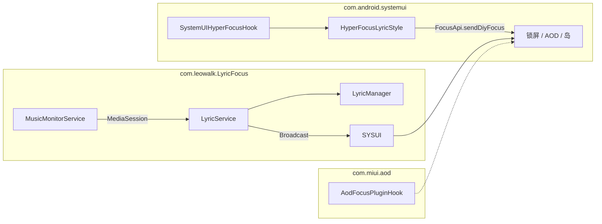

<div align="center">

# LyricFocus


在小米 HyperOS 上于**锁屏、AOD（息屏显示）、通知栏**展示同步歌词。  
通过 LSPosed 注入 SystemUI，使用 HyperOS **焦点通知**（`miui.focus.*`）渲染歌词；主界面副标题：**实现 HyperOS 锁屏息屏焦点歌词的 LSP 模块**。

包名：`com.leowalk.LyricFocus`

123网盘更新地址：https://1825191091.share.123pan.cn/123pan/jNBsjv-vZrV?pwd=Ifn3
</div>

---

## 📋 目录

- [功能概览](#功能概览)
- [系统要求](#系统要求)
- [架构与数据流](#架构与数据流)
- [项目结构](#项目结构)
- [安装与配置](#安装与配置)
- [设置项](#设置项)
- [歌词源](#歌词源)
- [进程间通信](#进程间通信)
- [Xposed Hook](#xposed-hook)
- [依赖](#依赖)
- [版本更新](#版本更新)
- [调试与反馈](#调试与反馈)
- [已知限制](#已知限制)
- [致谢](#致谢)
- [许可证](#许可证)

---

## 功能概览

- **Material 3 界面**：主界面、样式设置、关于页统一 Tonal 风格；工具栏 **重启 SystemUI** 图标（需 Root）
- **样式设置（v1.5）**：分 **通用**、**锁屏样式 AOD**、**万象息屏 AOD** 三类；开启万象息屏时锁屏样式项置灰，关闭时万象息屏专用项置灰
- **通用样式**：歌词与翻译位置互换、仅显示第一行（全局作用于全部布局）
- **锁屏样式 AOD**：字号、文字颜色、行数、排版、焦点通知背景；**Monet 动态取色** 与 **通知文字取色**
- **万象息屏 AOD 专用样式**：字号、歌词宽度（50–100%）、歌名显示（全部/隐藏歌名/隐藏歌手/全部隐藏）、歌词/翻译行数、排版、颜色（白/专辑取色/24 色推荐色 + RGB 自定义）；歌名 · 歌手 3:2 居中块，长标题代码 ellipsize
- **样式设置 UI（v1.5.1+）**：锁屏样式 AOD 合并为单卡片统一置灰；万象息屏字体排版区块与锁屏样式层级一致
- **Monet 动态取色**：从当前播放专辑封面实时提取背景与文字色（Material You 风格），自动增强对比度以保证歌词可读性；开启后手动背景/文字/文字取色选项置灰
- **实时歌词**：`NotificationListenerService` 绑定 MediaSession，监听播放进度与元数据
- **多歌词源**：网易云音乐、QQ 音乐（自动链式回退或指定单一源）
- **焦点通知**：锁屏 / AOD 使用 `miui.focus.rv`、`miui.focus.rvAod` 自定义 RemoteViews，支持 updatable 会话续期
- **万象息屏（自定义）AOD**：主界面开关；横向 `rvAod` 布局，修复万象/自定义息屏歌词只显示首字的问题
- **超级岛（默认关闭）**：主界面已移除开关，代码层固定关闭
- **应用白名单**：可选仅对指定音乐 App 的 MediaSession 响应；支持搜索已安装应用、手动添加包名
- **歌词提前量**：可调同步偏移（默认提前 200 ms）
- **Root 重启 SystemUI**：主界面右上角一键重启，Hook / 样式变更后快速生效
- **统一通知渠道**：后台服务通知合并为单一渠道，前台通知显示当前播放状态
- **关于界面**：软件信息、GitHub / 酷安链接、联系邮箱弹窗、系统要求、致谢与开源许可证
- **LSPosed 日志查看**：应用内选择日志文件/ZIP 压缩包，自动筛选 LyricFocus 相关日志，支持一键复制

---

## 系统要求

| 项目 | 要求 |
|------|------|
| 系统 | **小米 HyperOS 3.0+ **（验证环境：HyperOS 3.0.x，如 `3.0.302.0.WNCCNXM`） |
| Android | API **31+**，`targetSdk 34` |
| 框架 | **LSPosed**（或兼容 Xposed 实现），API 82+ |
| LSPosed 作用域 | `com.android.systemui`（系统界面）、`com.miui.aod`（息屏与锁屏编辑） |
| 权限 | 通知访问、发送通知、网络、前台服务、读取应用列表（白名单选应用，Android 11+） |
| 可选 | Root（Magisk / KernelSU）— 应用内重启 SystemUI、查看 LSPosed 日志 |

### 额外使用条件

**移除焦点通知白名单**：需移除系统级焦点通知白名单限制，否则 LyricFocus 无法正常显示歌词。可通过以下 LSPosed 模块实现：

| 模块 | 说明 | 链接 |
|------|------|------|
| **HyperIsland** | 移除焦点通知白名单，支持自定义超级岛内容 | https://github.com/1812z/HyperIsland |
| **HyperCeiler** | HyperOS 系统增强模块，包含焦点通知相关功能 | https://github.com/ReChronoRain/HyperCeiler |等

> 若未安装上述类似模块，焦点通知可能无法显示或被系统拦截。

---

## 架构与数据流

App 进程拉歌词，SystemUI 进程发焦点通知：



1. `MusicMonitorService` 获取活跃 `MediaController`，回调 `LyricService`
2. `LyricService` 拉取歌词，100 ms ticker + Alarm 兜底推进行号
3. 向 SystemUI 广播 `UPDATE_LYRIC` / `LYRIC_DATA`（见 [进程间通信](#进程间通信)）
4. `SystemUIHyperFocusHook` 调用 `HyperFocusLyricStyle.postFocusNotification()`
5. SystemUI 就绪后发 `REQUEST_RESYNC`，`FocusResyncReceiver` 重推状态

---

## 项目结构

```
LyricFocus/
├── settings.gradle
├── build.gradle
└── focus/
    ├── build.gradle
    └── src/main/
        ├── AndroidManifest.xml
        ├── assets/xposed_init          → FocusMainHook
        ├── java/com/leowalk/LyricFocus/
        │   ├── MainActivity.kt
        │   ├── StyleSettingsActivity.kt  → 样式设置（字号、取色、背景等）
        │   ├── AboutActivity.kt          → 关于界面（软件信息、日志查看、联系邮箱）
        │   ├── AppWhitelistActivity.kt   → 音乐应用白名单
        │   ├── FocusPreferences.kt
        │   ├── FocusStyleSnapshot.kt     → SystemUI 侧样式快照
        │   ├── lyric/                    # 网易云 / QQ、LRC 解析
        │   ├── service/                  # MediaSession、歌词服务、通知管理
        │   ├── notification/             # HyperFocusLyricStyle
        │   ├── receiver/                 # FocusResyncReceiver
        │   ├── util/                     # RootHelper、AlbumColorExtractor、InstalledAppsHelper
        │   └── xposed/                   # SystemUI / AOD Hook
        └── res/layout/                   # focus_lyric_* / activity_style_settings / about
```

---

## 安装与配置

### 前置条件

开始之前请确认：

| 项目 | 说明 |
|------|------|
| 设备 | 小米 / Redmi，已升级 **HyperOS 3.0+ ** |
| Android | **12 及以上**（`minSdk 31`） |
| Bootloader | 已解锁（安装 LSPosed 所需） |
| LSPosed | 已通过 Magisk / KernelSU 等模块安装并启用 |
| 网络 | 拉取歌词需联网（网易云 / QQ 音乐 API） |
| Root（推荐） | 非必须，但 Hook 变更后可在应用内一键重启 SystemUI、查看 LSPosed 日志 |

> 已在 HyperOS **3.0.302.0.WNCCNXM** 环境验证。其他 HyperOS 版本若焦点通知 API 有差异，可能需要适配。

---

### 方式一：下载 Release APK（推荐）

1. 在 [Releases](../../releases) 页面下载最新 `focus-*.apk`（或 `focus-debug.apk`）
2. 将 APK 传到手机，在系统设置中允许「安装未知来源应用」
3. 点击 APK 完成安装
4. 继续下方 [LSPosed 配置](#lsposed-配置) 与 [应用权限](#应用权限)

---

### 方式二：自行编译

**环境要求**：JDK 17、Android SDK（`compileSdk 34`）、Gradle（随仓库 Wrapper）

**Release 签名（安装 Release APK 必需）**：

1. 复制 `keystore.properties.example` 为 `keystore.properties`（已在 `.gitignore`，不会提交）
2. 若尚无密钥库，在项目根目录生成：

```bash
keytool -genkeypair -v -keystore lyricfocus-release.jks -alias lyricfocus \
  -keyalg RSA -keysize 2048 -validity 10000 \
  -storepass <你的密码> -keypass <你的密码> \
  -dname "CN=LyricFocus, OU=Dev, O=leowalk, L=Unknown, ST=Unknown, C=CN"
```

3. 在 `keystore.properties` 中填写 `storeFile`、`storePassword`、`keyAlias`、`keyPassword`

> 请妥善备份 `lyricfocus-release.jks` 与 `keystore.properties`，后续版本更新须使用同一签名，否则无法覆盖安装。

```bash
# 克隆仓库
git clone https://github.com/leowalk0613/LyricFocus.git
cd LyricFocus

# 编译 Debug APK（使用 debug 签名，可直接 adb 安装）
./gradlew :focus:assembleDebug

# 编译 Release APK（需 keystore.properties）
./gradlew :focus:assembleRelease
```

产物路径：

```
focus/build/outputs/apk/debug/focus-debug.apk
focus/build/outputs/apk/release/focus-release.apk
```

**Android Studio**：打开项目根目录 → Sync Gradle → 选择运行配置 **`focus`** → Run。

安装到已连接设备：

```bash
adb install -r focus/build/outputs/apk/debug/focus-debug.apk
adb install -r focus/build/outputs/apk/release/focus-release.apk
```

---

### LSPosed 配置

1. 打开 **LSPosed 管理器**
2. 进入 **模块** 列表，找到并启用 **LyricFocus**
3. 点击模块名称进入 **作用域**，勾选以下应用（缺一不可）：
   - **系统界面**（`com.android.systemui`）
   - **息屏与锁屏编辑**（`com.miui.aod`）
4. 保存后 **重启 SystemUI** 使 Hook 生效，任选其一：
   - 打开 LyricFocus → **重启系统界面**（需 Root，推荐）
   - LSPosed 日志页面对 SystemUI 执行重启
   - 直接 **重启手机**（最稳妥）

> 若只勾选 SystemUI 而未勾选 `com.miui.aod`，AOD 焦点歌词可能无法显示或权限校验失败。

---

### 应用权限

首次打开 LyricFocus 后，在 **权限设置** 卡片中逐项完成：

| 权限 | 如何开启 | 用途 |
|------|----------|------|
| **通知访问** | 点击「授权」→ 系统列表中找到 LyricFocus 并开启 | 读取 MediaSession，获取歌曲信息与播放进度 |
| **发送通知** | Android 13+ 点击「授权」允许；若已拒绝则跳转应用通知设置 | 前台服务通知、可选通知栏歌词 |
| **Root**（可选） | Magisk / KernelSU 授予 LyricFocus Root | 应用内重启 SystemUI、自动扫描 LSPosed 日志 |
| **读取应用列表**（可选） | 系统设置 → LyricFocus → 权限 → 读取应用列表 | 白名单「添加应用」时列出已安装音乐 App |

**HyperOS 额外建议**：

- **设置 → 应用 → LyricFocus → 省电策略** 设为「无限制」，避免后台被杀
- **设置 → 通知与状态栏 → 通知管理 → LyricFocus** 允许通知、关闭「静默」
- 若使用白名单，确认目标音乐 App 未被「应用双开」隔离到不同用户空间

---

### 首次使用步骤

按顺序操作，可减少「装了但没歌词」的情况：

1. **安装 APK** 并完成 [LSPosed 配置](#lsposed-配置)
2. **Root 重启 SystemUI**（或重启手机）
3. 打开 **LyricFocus**，授予 **通知访问** 与 **发送通知**
4. 确认 **服务状态** 显示为「运行中」
5. 打开任意音乐 App **播放歌曲**（带歌词 metadata 更易命中）
6. **锁屏** 或 **息屏（AOD）**，应看到焦点通知区域的歌词随播放更新
7. （可选）进入 **样式设置** 调整字号、Monet 动态取色等显示效果

**歌词源**：默认 `auto`（先网易云后 QQ）。可在设置中切换；界面会显示当前歌曲与命中来源。

**同步偏移**：歌词偏慢向右拖，偏快向左拖（默认提前 200 ms）。

**样式设置**：主界面「样式设置」入口（位于显示设置与权限设置之间），按场景分三类配置；修改后立即广播至 SystemUI 刷新当前歌词。

**万象息屏 AOD**：主界面「万象息屏（自定义）AOD」开关与样式设置内「万象息屏 AOD」区块配合使用；未开启开关时，专用样式项不可调整。

---

### 验证清单

| 检查项 | 预期结果 |
|--------|----------|
| LSPosed 模块状态 | LyricFocus 已启用，作用域含 SystemUI + AOD |
| 通知访问 | 设置页显示「已授权」 |
| 服务状态 | 「运行中」 |
| 播放音乐 | 「歌词获取源」下方出现歌曲名与来源命中 |
| 锁屏 | 焦点通知区显示当前歌词行 |
| 换行 | 歌词随进度切换，无明显长时间卡住 |

---

### 卸载

1. LSPosed 中 **关闭** LyricFocus 模块
2. **重启 SystemUI** 或重启手机（避免残留 Hook 行为）
3. 系统设置中 **卸载** LyricFocus
4. （可选）在「通知访问」设置中确认 LyricFocus 条目已消失

---

## 设置项

偏好文件：`lyric_focus_prefs`（`FocusPreferences.kt`）

| 设置 | 键 | 默认 | 说明 |
|------|-----|------|------|
| 焦点通知歌词 | `focus_lyric_enabled` | 开 | 总开关 |
| 通知栏显示 | `show_in_notification_shade` | 关 | 代码固定关闭（v1.3 主界面已移除开关） |
| 超级岛显示歌词 | `show_on_super_island` | 关 | 代码固定关闭（v1.3 主界面已移除开关） |
| 应用白名单 | `app_whitelist_enabled` | 关 | 限制 MediaSession 包名 |
| 白名单包名列表 | `app_whitelist_packages` | 空 | 开启白名单时默认填充常见音乐 App |
| 歌词获取源 | `lyric_source` | `auto` | `auto` / `netease` / `qq` |
| 歌词提前量 | `sync_advance_ms` | `200` | -1000 ~ 3000 ms |
| AOD 保活间隔 | `aod_keepalive_sec` | `9` | 受焦点会话 ~9s 系统上限约束 |
| 万象息屏 AOD | `custom_aod_layout` | 关 | 万象/自定义息屏时使用横向 rvAod 布局 |
| 歌词与翻译互换 | `swap_lyric_translation` | 关 | 全局：第一行显示翻译 |
| 仅显示第一行 | `single_line_only` | 关 | 全局：隐藏第二行 |
| 万象息屏字号 | `custom_aod_text_size` | `18` sp | 12 ~ 32 sp；仅万象息屏 AOD |
| 万象息屏歌词宽度 | `custom_aod_lyric_width` | `100` | 50 ~ 100 % |
| 万象息屏歌词行数 | `custom_aod_lyric_max_lines` | `2` | 1 ~ 2 |
| 万象息屏翻译行数 | `custom_aod_translation_max_lines` | `1` | 1 ~ 2 |
| 万象息屏排版 | `custom_aod_gravity` | `center` | `left` / `center` / `right`；歌名与歌词 |
| 万象息屏歌名显示 | `custom_aod_song_info` | `all` | `all` / `hide_title` / `hide_artist` / `hide_all` |
| 万象息屏颜色模式 | `custom_aod_color_mode` | `white` | `white` / `album` / `preset` |
| 万象息屏推荐色 | `custom_aod_preset_color` | 默认蓝 | `preset` 模式下生效 |
| 歌词字号 | `lyric_text_size` | `18` sp | 12 ~ 32 sp；锁屏样式 AOD |
| 文字颜色 | `lyric_text_color` | `white` | `white` / `black`；Monet 或文字取色开启时无效 |
| 歌词行数 | `lyric_max_lines` | `2` | 1 ~ 2 |
| 翻译行数 | `translation_max_lines` | `1` | 1 ~ 2 |
| 对齐方式 | `lyric_gravity` | `center` | `left` / `center` / `right`；锁屏样式 AOD |
| 焦点通知背景 | `focus_background` | `default` | `default` / `black` / `white`；Monet 开启时无效 |
| Monet 动态取色 | `monet_dynamic_color` | 关 | 专辑封面实时取背景+文字色 |
| 通知文字取色 | `lyric_color_extraction` | 关 | 仅文字取色；与 Monet 互斥 |

---

## 歌词源

| 源 | Provider | API |
|----|----------|-----|
| 网易云 | `NetEaseLyricProvider` | `music.163.com/api/...` |
| QQ 音乐 | `QQMusicLyricProvider` | `c.y.qq.com/...` |

- `auto`：先网易云，失败再 QQ
- 按 MediaSession 的**标题 + 艺术家**搜词；播放器不限于上述两家（如 Spotify，只要 API 能搜到）

`LrcParser` 支持标准 LRC、`[mm:ss:cc]` 网易格式、翻译合并、跳过作词/作曲行。

---

## 进程间通信

**App → SystemUI**（`setPackage("com.android.systemui")`）：

| Action | 说明 |
|--------|------|
| `com.leowalk.LyricFocus.action.UPDATE_LYRIC` | 当前行、第二行、播放状态 |
| `com.leowalk.LyricFocus.action.LYRIC_DATA` | LRC JSON、position、offset |
| `com.leowalk.LyricFocus.action.PLAYBACK_STATE` | 播放/暂停 |
| `com.leowalk.LyricFocus.action.SETTINGS_CHANGED` | 设置变更（含样式、白名单、Monet 取色） |

**SystemUI → App**：

| Action | 说明 |
|--------|------|
| `com.leowalk.LyricFocus.action.REQUEST_RESYNC` | SystemUI 就绪，请求重推 |

---

## Xposed Hook

入口：`com.leowalk.LyricFocus.xposed.FocusMainHook`

| 作用域 | 主要类 | 职责 |
|--------|--------|------|
| `com.android.systemui` | `SystemUIHyperFocusHook` | 广播、焦点通知、权限 bypass |
| | `SystemUIPluginHook` | 焦点/AOD 插件 ClassLoader bypass |
| | `FocusIslandSuppressHook` | 关闭超级岛兜底 |
| | `FocusAntiFlickerHook` | 换行防闪烁 |
| `com.miui.aod` | `AodFocusPluginHook` | AOD 进程焦点权限 bypass |

焦点通知构建见 `HyperFocusLyricStyle.kt`：`FocusApi.sendDiyFocus()`、渠道 `channel_id_focusNotifLyrics`。

---

## 依赖

| 依赖 | 版本 | 用途 |
|------|------|------|
| [HyperFocusApi](https://github.com/ghhccghk/HyperFocusApi) | 2.0 | `miui.focus` 参数封装 |
| [Xposed API](https://api.xposed.info/) | 82 | LSPosed Hook 接口 |
| OkHttp | 4.12.0 | 歌词 HTTP |
| AndroidX Palette | 1.0.0 | 专辑封面取色 |
| AndroidX / Material / Coroutines | 见 `focus/build.gradle` | UI、MediaSession |

---

## 版本更新

### v1.5.4

- **编译错误修复**：修复 `StyleSettingsFragment.kt` 中因 `view` 非类属性导致的 `view?.findViewById` 空安全错误，新增 `lyricLinesGroup`、`translationLinesGroup`、`gravityGroup` 等6个类属性并在 `bindViews()` 中统一绑定
- **欢迎界面跳转修复**：`setWelcomeCompleted()` 中 `apply()` 改为 `commit()`，确保 SharedPreferences 同步写入后再启动主界面，避免因异步写入导致的循环跳转
- **主界面启动崩溃修复**：调整 `setupWindowInsets()` 调用顺序，移至 `bottomNav` 初始化之后，修复 `lateinit property bottomNav has not been initialized` 崩溃
- **版本号**：`1.5.4`（versionCode 10）

### v1.5.2

- **歌名显示选项布局**：万象息屏「歌名显示」改为两行（全部显示 / 隐藏歌名 · 隐藏歌手 / 全部隐藏），避免四字挤在一行
- **版本号**：`1.5.2`（versionCode 8）

### v1.5.1

- **锁屏样式 AOD 单卡片**：不可用项合并为一张卡片统一置灰，与万象息屏区块表现一致
- **万象息屏歌名显示**：新增全部显示 / 隐藏歌名 / 隐藏歌手 / 全部隐藏
- **万象息屏样式层级**：文字大小、固定行数、排版等区块与锁屏样式 AOD 对齐
- **版本号**：`1.5.1`（versionCode 7）

### v1.5.0

- **万象息屏（自定义）AOD 支持**：新增「万象息屏（自定义）AOD」开关；开启后使用横向 `rvAod` 布局（`focus_lyric_aod_custom`），修复万象/自定义息屏下歌词与翻译只显示首字的问题
- **万象息屏内容增强**：显示歌名 · 歌手（3:2 宽度、居中块布局）、完整歌词与翻译；长歌名在绑定前 `TextUtils.ellipsize`，避免 RemoteViews 截断失效
- **样式设置三类分区**：**通用**（互换/单行）、**锁屏样式 AOD**、**万象息屏 AOD**；两类 AOD 样式互斥置灰，并显示对应提示
- **万象息屏专用样式**：独立字号、歌词宽度、行数、排版、颜色（白 / 专辑取色 / 24 推荐色 + RGB 自定义）
- **主界面**：副标题「实现 HyperOS 锁屏息屏焦点歌词的 LSP 模块」；「样式设置」移至显示设置与权限设置之间；**重启 SystemUI** 改为工具栏图标按钮
- **默认行为不变**：万象息屏开关默认关闭，锁屏样式 AOD 仍使用原有竖排 `focus_lyric_aod` 布局
- **版本号**：`1.5.0`（versionCode 6）

### v1.4.0

- **焦点歌词通知优先级优化**：提升焦点通知渠道优先级至 HIGH，使用 CATEGORY_TRANSPORT 与媒体通知同类别，通过 sortKey 和 when 确保焦点歌词始终排在媒体控制通知上方
- **SystemUI 端排序增强**：新增通知栈主动重排逻辑，扫描并将媒体通知移到焦点通知下方，确保排序稳定
- **文字对比度算法改进**：提高主文字/副文字对比度标准，优化颜色计算逻辑，确保在深色/浅色背景下文字清晰可见
- **通知字体取色优化**：深色背景下若取色结果为黑色/接近黑色，强制改为灰白色（#E0E0E0）；浅色背景下若取色结果为白色/接近白色，强制改为灰黑色（#1F1F1F）；确保文字始终保持一定灰度，在任何背景下清晰可见
- **版本号**：`1.4.0`（versionCode 5）

### v1.3.0

- **样式设置页面**：新增独立「样式设置」入口，支持歌词字号、文字颜色、歌词/翻译行数、对齐方式、焦点通知背景
- **Monet 动态取色**：从当前播放专辑封面实时提取背景与文字色（Material You 风格），按 WCAG 对比度增强可读性；换歌自动更新；开启后文字颜色、焦点背景、通知文字取色选项置灰不可改
- **通知文字取色**：保留仅提取文字强调色的模式（背景仍用手动设置），与 Monet 互斥
- **专辑封面取色链路**：新增 `AlbumArtLoader`、`AlbumColorExtractor`、`FocusStyleSnapshot`；封面 URI/Bitmap 加载、换歌重同步、跨进程样式广播
- **应用白名单增强**：修复 Android 11+ 包可见性导致应用列表不全；声明 `QUERY_ALL_PACKAGES`；改用 `getInstalledApplications`；支持搜索选应用、手动添加包名
- **主界面 UI**：全部按钮统一为 Material 3 Tonal 风格；重启按钮文案简化为「重启」；Root 权限项增加「（用于系统界面重启）」说明
- **主界面精简**：移除「通知栏也显示」「超级岛显示歌词」开关，代码层固定为关闭
- **关于页优化**：按钮风格统一；联系邮箱改为弹窗（显示地址 + 发邮件）；日志复制按钮风格一致
- **版本号**：`1.3.0`（versionCode 4）

### v1.2.0

- **通知合并优化**：通知栏歌词与前台服务通知合并为一个，开启时显示歌词，关闭时显示服务状态
- **歌词显示优化**：歌词加载前或无歌词时，优先显示歌名和歌手信息
- **LSPosed 日志查看增强**：新增自动扫描模式（需 Root），支持扫描 `/data/adb/lspd/log/` 和 `/data/adb/lspd/log.old/` 目录，自动筛选 `modules_*.log` 文件；保留手动选择文件方式（无需 Root）
- **日志一键复制**：在日志查看器中添加复制按钮，便于反馈问题
- **定时健康检查**：添加 5 秒定时检查机制，自动检测并刷新歌词状态，修复歌词不刷新问题
- **酷安作者链接**：在关于界面添加酷安作者主页链接
- **默认同步偏移调整**：从 1300ms 改为 200ms

### v1.1.0

- **统一通知渠道**：后台服务通知合并为单一 `lyric_service` 渠道
- **关于界面**：添加软件详细信息、GitHub 链接、酷安作者链接、系统要求、致谢与开源许可证
- **LSPosed 日志查看**：应用内选择日志文件/ZIP压缩包，自动筛选 LyricFocus 相关日志，支持一键复制
- **包名变更**：改为 `com.leowalk.LyricFocus`

---

## 调试与反馈

### 日志标签

| Tag | 来源 |
|-----|------|
| `LyricFocus_Xposed` | Xposed 入口 |
| `SystemUIHyperFocusHook` | SystemUI Hook |
| `LyricService` | 歌词服务 |
| `MusicMonitorService` | 媒体监控服务 |

### 查看 LSPosed 日志

#### 方法一：自动扫描（推荐，需 Root）

1. 确保设备已获取 **Root 权限**
2. 打开 **LyricFocus** → 点击底部导航「关于」
3. 点击 **选择日志文件筛选**
4. 在弹出的选项中选择 **自动扫描 LSPosed 日志**
5. 应用会自动扫描以下路径：
   - `/data/adb/lspd/log/` — 当前日志目录
   - `/data/adb/lspd/log.old/` — 旧日志目录
6. 自动筛选 `modules_*.log` 文件中的 LyricFocus 相关日志
7. 如需反馈问题，点击 **复制日志** 将日志复制到剪贴板

#### 方法二：手动选择（无需 Root）

1. 打开 **LSPosed 管理器**
2. 点击右上角菜单 → **保存日志**（会导出为 zip 压缩包）
3. **解压**导出的 zip 压缩包，或直接从 `/data/adb/lspd/log/` 目录复制 `modules_*.log` 文件到手机存储（如 Download 文件夹）
4. 打开 **LyricFocus** → 点击底部导航「关于」
5. 点击 **选择日志文件筛选**
6. 在弹出的选项中选择 **手动选择日志文件**
7. 选择解压后的 `.log` 文件（支持多选）
8. 应用会自动筛选并显示 LyricFocus 相关日志
9. 如需反馈问题，点击 **复制日志** 将日志复制到剪贴板

#### 方法三：ADB 命令

```bash
# 查看所有 LyricFocus 相关日志
adb logcat | findstr "LyricFocus"

# 保存日志到文件
adb logcat -d > logcat.txt
```

### 日志文件说明

LSPosed 日志目录结构：

```
/data/adb/lspd/log/
├── modules_2026-06-28T15:30:37.775962.log  # 模块日志（按时间命名）
└── LSPosed_xxx.zip                          # 导出的 zip 压缩包（需解压后使用）

/data/adb/lspd/log.old/                      # 旧日志备份
```

**注意**：手动选择日志文件时，需要先解压 zip 压缩包，或直接复制 `modules_*.log` 文件到手机存储。

### 反馈问题

遇到问题时，请按以下步骤操作：

1. **确认问题场景**：记录问题发生的具体条件（如：播放某首歌时、锁屏时、AOD 时等）
2. **保存日志**：按照「查看 LSPosed 日志」方法一保存日志
3. **复制日志**：在应用内日志查看器中点击「复制日志」
4. **选择反馈渠道**：
   - **GitHub Issues**：[https://github.com/leowalk0613/LyricFocus/issues](https://github.com/leowalk0613/LyricFocus/issues)
   - **酷安作者**：[https://www.coolapk.com/u/551303](https://www.coolapk.com/u/551303)
   - **邮箱**：`walkalone9990613@gmail.com`（关于页 → 联系邮箱）
5. **描述问题**：详细描述问题现象，并附上复制的日志内容

### 常见问题排查

**Q：LSPosed 已启用，但完全没有歌词**

- 确认作用域是否同时勾选 `com.android.systemui` 与 `com.miui.aod`
- Root 重启 SystemUI 或重启手机
- 检查通知访问是否已授权
- 在应用内日志查看器中过滤 `LyricFocus_Xposed`、`SystemUIHyperFocusHook` 是否有报错

**Q：锁屏有歌词，AOD 没有**

- 确认 `com.miui.aod` 在作用域内
- 系统设置中 AOD 已开启且支持焦点通知样式
- HyperOS 焦点 updatable 会话约 **9 秒**超时，AOD 依赖周期性续期；若仍异常可查看 `LyricService` 日志

**Q：有通知但没有歌词文本 / 只显示占位**

- 当前歌曲可能在网易云 / QQ API 未搜到，尝试切换歌词源
- 检查网络与 DNS；部分区域需稳定网络访问 `music.163.com` / `c.y.qq.com`

**Q：歌词有时不会自动刷新**

- 已修复：添加了 5 秒定时健康检查，自动检测并刷新歌词状态

**Q：Hook 或设置改了不生效**

- 使用主界面右上角 **重启系统界面**（需 Root）
- 或重启手机

**Q：重启系统界面后万象息屏显示异常怎么办？**

- 重启 SystemUI 后，若万象息屏（自定义）AOD 出现样式错乱、不刷新或布局异常，一般属于重启后的短暂不同步，无需反复开关或再次重启。

- **切到下一首歌即可恢复**：换歌会重新推送歌词与焦点通知，万象息屏显示通常会立即回到正常状态。

**Q：万象息屏专辑取色发暗、在黑底上看不清？**

- 万象息屏「专辑取色」会按息屏黑底单独算对比度，与锁屏 Monet/文字取色的字色无关。
- 若仍偏暗，可在样式设置 → 万象息屏 AOD 中改用「白色」或「推荐色」。

**Q：非小米 / 非 HyperOS 能否使用？**

- **不能**。本应用依赖 HyperOS 焦点通知（`miui.focus.*`）与 SystemUI Hook，其他 ROM 不支持。

---

## 已知限制

- 仅适用于小米 HyperOS 焦点通知，其他 ROM 不可用
- 系统大版本升级可能导致 Hook 类名变化，需适配
- 焦点 updatable 会话有约 9s 系统超时，AOD 靠周期性 notify 续期
- 歌词准确度取决于 API 搜索与 LRC 质量

---

## 致谢

感谢下列项目提供框架、依赖与实现参考。

### 焦点通知

- **[HyperCeiler](https://github.com/ReChronoRain/HyperCeiler)** — 焦点歌词、`MusicBaseHook` / `FocusNotifLyric` 思路；渠道 ID、插件 ClassLoader bypass、防闪烁等见 `HyperFocusLyricStyle`、`SystemUIHyperFocusHook`、`SystemUIPluginHook`、`FocusAntiFlickerHook`
- **[FocusNotifLyric](https://github.com/ghhccghk/FocusNotifLyric)**（[wuyou-123](https://github.com/wuyou-123)）— 焦点歌词上游原型，已并入 HyperCeiler
- **[HyperFocusApi](https://github.com/ghhccghk/HyperFocusApi)** — Gradle 依赖；Demo：[HyperFocusNotifDemo](https://github.com/ghhccghk/HyperFocusNotifDemo)

### 框架与库

- **[LSPosed](https://github.com/LSPosed/LSPosed)** · **[XposedBridge](https://github.com/rovo89/XposedBridge)** · [AndroidX](https://github.com/androidx/androidx) · [OkHttp](https://github.com/square/okhttp) · [Kotlin](https://github.com/JetBrains/kotlin)

### 同生态

- [Lyric-Getter](https://github.com/xiaowine/Lyric-Getter) / [Lyric-Getter-Api](https://github.com/xiaowine/Lyric-Getter-Api) — FocusNotifLyric 常配合的歌词方案；本仓库歌词走网易云/QQ Provider
- [HookTool](https://github.com/HChenX/HookTool) · [Cemiuiler](https://github.com/ReChronoRain/Cemiuiler)

歌词 Web API 版权归网易云、QQ 音乐各自平台所有。

---

## 许可证

MIT License

## 📷 效果图

### 主设置界面


### 锁屏歌词（桌面状态）


### 锁屏歌词（AOD 息屏）


---
