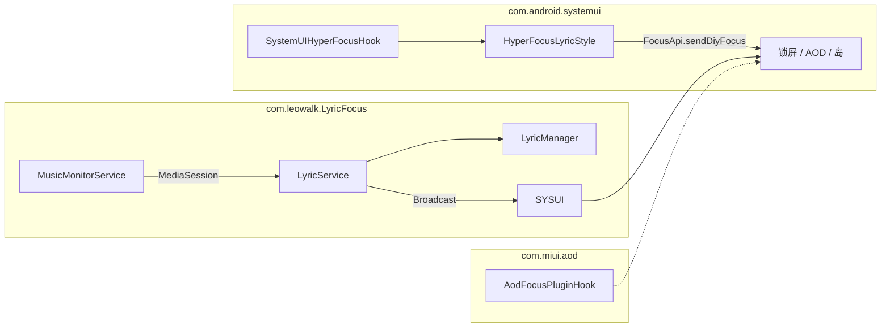

<div align="center">

<h1 align="center">
  
  LyricFocus
</h1>


在小米 HyperOS 上于**锁屏、AOD（息屏显示）、通知中心**展示同步歌词。  
通过 LSPosed 注入 SystemUI，使用 HyperOS **焦点通知**（`miui.focus.*`）渲染歌词；主界面副标题：**实现 HyperOS 锁屏息屏焦点歌词的 LSP 模块**。

包名：`com.leowalk.LyricFocus`

[123网盘更新地址](https://1825191091.share.123pan.cn/123pan/jNBsjv-vZrV?pwd=Ifn3)  
[GitHub Releases](https://github.com/leowalk0613/LyricFocus/releases)
</div>

---

## 📋 目录

- [功能概览](#功能概览)
- [系统要求](#系统要求)
- [架构与数据流](#架构与数据流)
- [项目结构](#项目结构)
- [安装与配置](#安装与配置)
- [设置项](#设置项)
- [歌词源](#歌词源)
- [进程间通信](#进程间通信)
- [Xposed Hook](#xposed-hook)
- [依赖](#依赖)
- [版本更新](#版本更新)
- [调试与反馈](#调试与反馈)
- [已知限制](#已知限制)
- [致谢](#致谢)
- [许可证](#许可证)

---

## 功能概览

- **Material 3 界面**：主界面、样式设置、关于页统一 Tonal 风格；工具栏常驻 **版本信息** 按钮（有更新时变红，无更新时白色可查看当前版本日志）与 **重启 SystemUI** 图标（需 Root）
- **版本更新检测**：应用启动后同时检测 GitHub 与 Gitee Release，并行请求取最新版本；有更新时工具栏按钮变红并显示更新日志与下载链接，无更新时点击按钮可查看当前版本更新日志；检测完全在后台线程，不阻塞界面
- **Monet 应用图标（v1.6.1）**：对话气泡 + 音符自适应图标；背景 / 图形跟随壁纸 `system_accent` 取色，并提供主题图标 monochrome 层
- **权限设置（v1.6.1）**：分为必要 / 其他；每项显示用途说明与状态图标；支持自启动、读取应用列表、忽略电池优化跳转
- **样式设置（v1.5）**：分 **通用**、**锁屏样式 AOD**、**万象息屏 AOD** 三类；开启万象息屏时锁屏样式项置灰，关闭时万象息屏专用项置灰
- **通用样式**：歌词与翻译位置互换、仅显示第一行、**焦点通知背景**、**Monet 动态取色** 与 **通知文字取色**（全局作用于全部布局）
- **锁屏样式 AOD**：字号、文字颜色、固定行数、排版、**多行模式**（4 / 6 / 8 行按页显示；有翻译时可交错显示原文与更淡翻译）
- **万象息屏 AOD 专用样式**：字号、歌词宽度（50–100%）、歌名显示（全部/隐藏歌名/隐藏歌手/全部隐藏）、歌词/翻译行数、排版、颜色（白/专辑取色/24 色推荐色 + RGB 自定义）；歌名 · 歌手 3:2 居中块，长标题代码 ellipsize
- **样式设置 UI（v1.5.1+）**：锁屏样式 AOD 合并为单卡片统一置灰；万象息屏字体排版区块与锁屏样式层级一致
- **Monet 动态取色**：从当前播放专辑封面实时提取背景与文字色（Material You 风格），自动增强对比度以保证歌词可读性；开启后手动背景/文字/文字取色选项置灰
- **实时歌词**：`NotificationListenerService` 绑定 MediaSession，监听播放进度与元数据
- **多歌词源**：网易云音乐、QQ 音乐、本地 LRC 文件、AI 翻译（自动链式回退或指定单一源）；本地源支持应用内选文件夹与三语 LRC
- **AI 翻译增强（v1.6.1）**：连通性检测；可选「翻译所有歌词」覆盖已有译文；配置说明兼容各类 OpenAI Chat Completions 格式 API
- **歌词焦点通知置顶**：歌词焦点卡片优先于其他焦点通知（含倒计时、HyperIsland 转换通知）
- **万象息屏（自定义）AOD**：主界面开关；横向 `rvAod` 布局，修复万象/自定义息屏歌词只显示首字的问题；歌名左侧可显示音乐图标（按歌词颜色染色，网易云音乐自动识别预设图标）
- **超级岛（固定关闭）**：主界面已移除开关，代码层固定关闭
- **防闪烁 Hook 已移除**：`FocusAntiFlickerHook` 已删除——新的原地更新方案不再触发焦点通知入场动画，无需手动压制
- **通知更新模式**：锁屏 / AOD 歌词换行不再重建通知会话，仅更新通知内 RemoteViews 内容
- **应用白名单**：可选仅对指定音乐 App 的 MediaSession 响应；支持搜索已安装应用、手动添加包名
- **歌词提前量**：可调同步偏移（默认提前 200 ms）
- **Root 重启 SystemUI**：主界面右上角一键重启，Hook / 样式变更后快速生效
- **统一通知渠道**：后台服务通知合并为单一渠道；焦点渠道文案标注为 LyricFocus
- **服务自启动**：开机完成、用户解锁后自动拉起歌词服务；AlarmManager 周期性保活
- **关于界面**：软件信息、项目信息与联系作者、获取日志（自动扫描 / 手动选择）、系统要求按钮（位于第一个卡片右上角）、许可证与致谢
- **LSPosed 日志查看**：应用内选择日志文件/ZIP 压缩包，自动筛选 LyricFocus 相关日志，支持一键复制

---

## 系统要求

| 项目 | 要求 |
|------|------|
| 系统 | **小米 HyperOS 3.0+ **（验证环境：HyperOS 3.0.x，如 `3.0.302.0.WNCCNXM`） |
| Android | API **31+**，`targetSdk 34` |
| 框架 | **LSPosed 2.0**（API 102），旧版 LSPosed (API 82) 不再兼容。**必须更新！** |
| LSPosed 作用域 | `com.android.systemui`（系统界面）、`com.miui.aod`（息屏与锁屏编辑） |
| 权限 | 通知访问、发送通知、网络、前台服务、读取应用列表（白名单选应用，Android 11+） |
| 可选 | Root（Magisk / KernelSU）— 应用内重启 SystemUI、查看 LSPosed 日志 |

### 额外使用条件

**移除焦点通知白名单**：需移除系统级焦点通知白名单限制，否则 LyricFocus 无法正常显示歌词。可通过以下 LSPosed 模块实现：

| 模块 | 说明 | 链接 |
|------|------|------|
| **HyperIsland** | 移除焦点通知白名单，支持自定义超级岛内容 | [GitHub](https://github.com/1812z/HyperIsland) |
| **HyperCeiler** | HyperOS 系统增强模块，包含焦点通知相关功能 | [GitHub](https://github.com/ReChronoRain/HyperCeiler) |等

> 若未安装上述类似模块，焦点通知可能无法显示或被系统拦截。

---

## 架构与数据流

App 进程拉歌词，SystemUI 进程发焦点通知：


```mermaid
flowchart LR
    subgraph App["com.leowalk.LyricFocus"]
        MMS[MusicMonitorService]
        LS[LyricService]
        LM[LyricManager]
        MMS -->|MediaSession| LS
        LS --> LM
        LS -->|Broadcast| SYSUI
    end

    subgraph SystemUI["com.android.systemui"]
        HOOK[SystemUIHyperFocusHook]
        STYLE[HyperFocusLyricStyle]
        HOOK --> STYLE
        STYLE -->|FocusApi.sendDiyFocus| FN[锁屏 / AOD / 岛]
    end

    subgraph AOD["com.miui.aod"]
        AODH[AodFocusPluginHook]
    end

    SYSUI --> FN
    AODH -.-> FN
```

1. `MusicMonitorService` 获取活跃 `MediaController`，回调 `LyricService`
2. `LyricService` 拉取歌词，100 ms ticker + Alarm 兜底推进行号
3. 向 SystemUI 广播 `UPDATE_LYRIC` / `LYRIC_DATA`（见 [进程间通信](#进程间通信)）
4. `SystemUIHyperFocusHook` 调用 `HyperFocusLyricStyle.postFocusNotification()`
5. SystemUI 就绪后发 `REQUEST_RESYNC`，`FocusResyncReceiver` 重推状态

---

## 项目结构

```
LyricFocus/
├── settings.gradle
├── build.gradle
└── focus/
    ├── build.gradle
    └── src/main/
        ├── AndroidManifest.xml
        ├── assets/xposed_init          → FocusMainHook
        ├── java/com/leowalk/LyricFocus/
        │   ├── MainActivity.kt
        │   ├── StyleSettingsActivity.kt  → 样式设置（字号、取色、背景等）
        │   ├── AboutActivity.kt          → 关于界面（软件信息、日志查看、联系邮箱）
        │   ├── AppWhitelistActivity.kt   → 音乐应用白名单
        │   ├── FocusPreferences.kt
        │   ├── FocusStyleSnapshot.kt     → SystemUI 侧样式快照
        │   ├── lyric/                    # 网易云 / QQ、LRC 解析
        │   ├── service/                  # MediaSession、歌词服务、通知管理
        │   ├── notification/             # HyperFocusLyricStyle
        │   ├── receiver/                 # FocusResyncReceiver、ServiceRestartReceiver
        │   ├── util/                     # RootHelper、AlbumColorExtractor、InstalledAppsHelper、UpdateChecker
        │   └── xposed/                   # SystemUI / AOD Hook
        └── res/layout/                   # focus_lyric_* / activity_style_settings / about
```

---

## 安装与配置

### 前置条件

开始之前请确认：

| 项目 | 说明 |
|------|------|
| 设备 | 小米 / Redmi，已升级 **HyperOS 3.0+ ** |
| Android | **12 及以上**（`minSdk 31`） |
| Bootloader | 已解锁（安装 LSPosed 所需） |
| LSPosed | 已通过 Magisk / KernelSU 等模块安装并启用 |
| 网络 | 拉取歌词需联网（网易云 / QQ 音乐 API） |
| Root（推荐） | 非必须，但 Hook 变更后可在应用内一键重启 SystemUI、查看 LSPosed 日志 |

> 已在 HyperOS **3.0.302.0.WNCCNXM** 环境验证。其他 HyperOS 版本若焦点通知 API 有差异，可能需要适配。

---

### 方式一：下载 Release APK（推荐）

1. 在 [Releases](../../releases) 页面下载最新 `LyricFocus.v*.apk`（如 `LyricFocus.v1.8.0.apk`）
2. 将 APK 传到手机，在系统设置中允许「安装未知来源应用」
3. 点击 APK 完成安装
4. 继续下方 [LSPosed 配置](#lsposed-配置) 与 [应用权限](#应用权限)

---

### 方式二：自行编译

**环境要求**：JDK 17、Android SDK（`compileSdk 34`）、Gradle（随仓库 Wrapper）

**Release 签名（安装 Release APK 必需）**：

1. 复制 `keystore.properties.example` 为 `keystore.properties`（已在 `.gitignore`，不会提交）
2. 若尚无密钥库，在项目根目录生成：

```bash
keytool -genkeypair -v -keystore lyricfocus-release.jks -alias lyricfocus \
  -keyalg RSA -keysize 2048 -validity 10000 \
  -storepass <你的密码> -keypass <你的密码> \
  -dname "CN=LyricFocus, OU=Dev, O=leowalk, L=Unknown, ST=Unknown, C=CN"
```

3. 在 `keystore.properties` 中填写 `storeFile`、`storePassword`、`keyAlias`、`keyPassword`

> 请妥善备份 `lyricfocus-release.jks` 与 `keystore.properties`，后续版本更新须使用同一签名，否则无法覆盖安装。

```bash
# 克隆仓库
git clone https://github.com/leowalk0613/LyricFocus.git
cd LyricFocus

# 编译 Debug APK（使用 debug 签名，可直接 adb 安装）
./gradlew :focus:assembleDebug

# 编译 Release APK（需 keystore.properties）
./gradlew :focus:assembleRelease
```

产物路径：

```
focus/build/outputs/apk/debug/focus-debug.apk
focus/build/outputs/apk/release/focus-release.apk
```

上传到 GitHub Release 时，请将 Release APK 重命名为 `LyricFocus.v{versionName}.apk`（如 `LyricFocus.v1.6.1.apk`），与现有 Release 资源命名一致。

**Android Studio**：打开项目根目录 → Sync Gradle → 选择运行配置 **`focus`** → Run。

安装到已连接设备：

```bash
adb install -r focus/build/outputs/apk/debug/focus-debug.apk
adb install -r focus/build/outputs/apk/release/focus-release.apk
```

---

### LSPosed 配置

1. 打开 **LSPosed 管理器**
2. 进入 **模块** 列表，找到并启用 **LyricFocus**
3. 点击模块名称进入 **作用域**，勾选以下应用（缺一不可）：
   - **系统界面**（`com.android.systemui`）
   - **息屏与锁屏编辑**（`com.miui.aod`）
4. 保存后 **重启 SystemUI** 使 Hook 生效，任选其一：
   - 打开 LyricFocus → **重启系统界面**（需 Root，推荐）
   - LSPosed 日志页面对 SystemUI 执行重启
   - 直接 **重启手机**（最稳妥）

> 若只勾选 SystemUI 而未勾选 `com.miui.aod`，AOD 焦点歌词可能无法显示或权限校验失败。

---

### 应用权限

首次打开 LyricFocus 后，在 **权限设置** 卡片中逐项完成：

| 分类 | 权限 | 如何开启 | 用途 |
|------|------|----------|------|
| 必要 | **通知访问** | 点击「授权」→ 应用列表中找到 LyricFocus 并开启 | 读取 MediaSession，获取歌曲信息与播放进度 |
| 必要 | **发送通知** | Android 13+ 点击「授权」允许；若已拒绝则跳转应用通知设置 | 前台服务保活与相关通知 |
| 其他 | **Root** | Magisk / KernelSU 授予 LyricFocus Root | 应用内重启 SystemUI、自动扫描 LSPosed 日志 |
| 其他 | **读取应用列表** | 点击「设置」跳转应用权限页 | 白名单「添加应用」时列出已安装音乐 App |
| 其他 | **自启动** | 点击「设置」跳转系统自启动页（MIUI / HyperOS） | 开机与后台拉起服务 |
| 其他 | **忽略电池优化** | 点击「设置」跳转电池优化白名单 | 减少后台被冻结 |

**HyperOS 额外建议**：

- **设置 → 应用 → LyricFocus → 省电策略** 设为「无限制」，并开启自启动
- **设置 → 通知与状态栏 → 通知管理 → LyricFocus** 允许通知、关闭「静默」
- 若使用白名单，确认目标音乐 App 未被「应用双开」隔离到不同用户空间

---

### 首次使用步骤

按顺序操作，可减少「装了但没歌词」的情况：

1. **安装 APK** 并完成 [LSPosed 配置](#lsposed-配置)
2. **Root 重启 SystemUI**（或重启手机）
3. 打开 **LyricFocus**，授予 **通知访问** 与 **发送通知**
4. 确认 **服务状态** 显示为「运行中」
5. 打开任意音乐 App **播放歌曲**（带歌词 metadata 更易命中）
6. **锁屏** 或 **息屏（AOD）**，应看到焦点通知区域的歌词随播放更新
7. （可选）进入 **样式设置** 调整字号、Monet 动态取色等显示效果

**歌词源**：默认 `auto`（先网易云后 QQ）。可在设置中切换；界面会显示当前歌曲与命中来源。

**同步偏移**：歌词偏慢向右拖，偏快向左拖（默认提前 200 ms）。

**样式设置**：主界面「样式设置」入口（位于显示设置与权限设置之间），按场景分三类配置；修改后立即广播至 SystemUI 刷新当前歌词。

**万象息屏 AOD**：主界面「万象息屏（自定义）AOD」开关与样式设置内「万象息屏 AOD」区块配合使用；未开启开关时，专用样式项不可调整。

---

### 验证清单

| 检查项 | 预期结果 |
|--------|----------|
| LSPosed 模块状态 | LyricFocus 已启用，作用域含 SystemUI + AOD |
| 通知访问 | 设置页显示「已授权」 |
| 服务状态 | 「运行中」 |
| 播放音乐 | 「歌词获取源」下方出现歌曲名与来源命中 |
| 锁屏 | 焦点通知区显示当前歌词行 |
| 换行 | 歌词随进度切换，无明显长时间卡住 |

---

### 卸载

1. LSPosed 中 **关闭** LyricFocus 模块
2. **重启 SystemUI** 或重启手机（避免残留 Hook 行为）
3. 系统设置中 **卸载** LyricFocus
4. （可选）在「通知访问」设置中确认 LyricFocus 条目已消失

---

## 设置项

偏好文件：`lyric_focus_prefs`（`FocusPreferences.kt`）

| 设置 | 键 | 默认 | 说明 |
|------|-----|------|------|
| 焦点通知歌词 | `focus_lyric_enabled` | 开 | 总开关 |
| 通知栏显示 | `show_in_notification_shade` | 关 | 代码固定关闭（v1.3 主界面已移除开关） |
| 超级岛显示歌词 | `show_on_super_island` | 关 | 代码固定关闭（v1.3 主界面已移除开关） |
| 应用白名单 | `app_whitelist_enabled` | 关 | 限制 MediaSession 包名 |
| 白名单包名列表 | `app_whitelist_packages` | 空 | 开启白名单时默认填充常见音乐 App |
| 歌词获取源 | `lyric_source` | `auto` | `auto` / `netease` / `qq` |
| 歌词提前量 | `sync_advance_ms` | `200` | -1000 ~ 3000 ms |
| AOD 保活间隔 | `aod_keepalive_sec` | `9` | 受焦点会话 ~9s 系统上限约束 |
| 万象息屏 AOD | `custom_aod_layout` | 关 | 万象/自定义息屏时使用横向 rvAod 布局 |
| 歌词与翻译互换 | `swap_lyric_translation` | 关 | 全局：第一行显示翻译 |
| 仅显示第一行 | `single_line_only` | 关 | 全局：隐藏第二行；多行模式下不可用 |
| 万象息屏字号 | `custom_aod_text_size` | `18` sp | 12 ~ 32 sp；仅万象息屏 AOD |
| 万象息屏歌词宽度 | `custom_aod_lyric_width` | `100` | 50 ~ 100 % |
| 万象息屏歌词行数 | `custom_aod_lyric_max_lines` | `2` | 1 ~ 2 |
| 万象息屏翻译行数 | `custom_aod_translation_max_lines` | `1` | 1 ~ 2 |
| 万象息屏排版 | `custom_aod_gravity` | `center` | `left` / `center` / `right`；歌名与歌词 |
| 万象息屏歌名显示 | `custom_aod_song_info` | `all` | `all` / `hide_title` / `hide_artist` / `hide_all` |
| 万象息屏颜色模式 | `custom_aod_color_mode` | `white` | `white` / `album` / `preset` |
| 万象息屏推荐色 | `custom_aod_preset_color` | 默认蓝 | `preset` 模式下生效 |
| 万象息屏标题图标 | `custom_aod_title_icon_enabled` | 关 | AOD 歌名左侧显示音乐图标 |
| 万象息屏图标大小 | `custom_aod_title_icon_size` | `150` | 75 ~ 200 %；相对歌名字号 |
| 歌词字号 | `lyric_text_size` | `18` sp | 12 ~ 32 sp；锁屏样式 AOD |
| 文字颜色 | `lyric_text_color` | `white` | `white` / `black`；Monet 或文字取色开启时无效 |
| 歌词行数 | `lyric_max_lines` | `2` | 1 ~ 2；多行模式下不可用 |
| 翻译行数 | `translation_max_lines` | `1` | 1 ~ 2；多行模式下不可用 |
| 多行模式 | `multi_line_lyrics` | 关 | 锁屏按页多行歌词 |
| 多行显示翻译 | `multi_line_show_translation` | 开 | 有翻译时交错填满所选行数 |
| 多行行数 | `multi_line_line_count` | `8` | 4 / 6 / 8 |
| 多行字号 | `multi_line_text_size` | `14` | 12 ~ 32 sp |
| 对齐方式 | `lyric_gravity` | `center` | `left` / `center` / `right`；锁屏样式 AOD |
| 焦点通知背景 | `focus_background` | `default` | `default` / `black` / `white`；Monet 开启时无效 |
| Monet 动态取色 | `monet_dynamic_color` | 关 | 专辑封面实时取背景+文字色 |
| 通知文字取色 | `lyric_color_extraction` | 关 | 仅文字取色；与 Monet 互斥 |

---

## 歌词源

| 源 | Provider | API |
|----|----------|-----|
| 网易云 | `NetEaseLyricProvider` | `music.163.com/api/...` |
| QQ 音乐 | `QQMusicLyricProvider` | `u.y.qq.com/cgi-bin/musicu.fcg`（搜索）、`i.y.qq.com/lyric/...`（歌词） |
| 本地 LRC | `LocalLrcLyricProvider` | 应用内选择文件夹（SAF），或应用私有 `lyrics` 目录 |
| AI 翻译 | `AiLyricTranslator` | OpenAI 兼容 `/chat/completions`（需配置 API Key） |

- `auto`：先网易云，失败再 QQ
- `local`：匹配本地 `.lrc`（应用内**选择文件夹**；支持「歌名 - 歌手」/「歌手 - 歌名」及三语同时间戳格式）
- `ai`：先在线获取歌词，再调用 AI 生成译文（需配置 API Key）
- 按 MediaSession 的**标题 + 艺术家**搜词；播放器不限于上述两家（如 Spotify，只要 API 能搜到）

`LrcParser` 支持标准 LRC、`[mm:ss:cc]` 网易格式、外部翻译合并、三语 LRC（原文 / 翻译 / 读音同时间戳合并）、跳过作词/作曲行。

---

## 进程间通信

**App → SystemUI**（`setPackage("com.android.systemui")`）：

| Action | 说明 |
|--------|------|
| `com.leowalk.LyricFocus.action.UPDATE_LYRIC` | 当前行、第二行、播放状态 |
| `com.leowalk.LyricFocus.action.LYRIC_DATA` | LRC JSON、position、offset |
| `com.leowalk.LyricFocus.action.PLAYBACK_STATE` | 播放/暂停 |
| `com.leowalk.LyricFocus.action.SETTINGS_CHANGED` | 设置变更（含样式、白名单、Monet 取色） |

**SystemUI → App**：

| Action | 说明 |
|--------|------|
| `com.leowalk.LyricFocus.action.REQUEST_RESYNC` | SystemUI 就绪，请求重推 |
| `com.leowalk.LyricFocus.action.RESTART_SERVICE` | 服务自启动/保活 |

---

## Xposed Hook

入口：`com.leowalk.LyricFocus.xposed.FocusMainHook`

> **已完整迁移至 Modern Xposed API**（LSPosed 2.0 / API 102）。入口继承 `XposedModule`，使用 `module.hook(method).intercept { chain -> }` 拦截器链，`getRemotePreferences()` 替代 `XSharedPreferences`，不再依赖 legacy `de.robv.android.xposed`。

| 作用域 | 主要类 | 职责 |
|--------|--------|------|
| `com.android.systemui` | `SystemUIHyperFocusHook` | 广播、焦点通知、权限 bypass |
| | `FocusPinAboveHook` | 焦点通知数据层/视图层置顶歌词卡片 |
| | `SystemUIPluginHook` | 焦点/AOD 插件 ClassLoader bypass |
| | `FocusIslandSuppressHook` | 关闭超级岛兜底 |
| `com.miui.aod` | `AodFocusPluginHook` | AOD 进程焦点权限 bypass |

焦点通知构建见 `HyperFocusLyricStyle.kt`：`FocusApi.sendDiyFocus()`、渠道 `channel_id_focusNotifLyrics`。

---

## 依赖

| 依赖 | 版本 | 用途 |
|------|------|------|
| [HyperFocusApi](https://github.com/ghhccghk/HyperFocusApi) | 2.0 | `miui.focus` 参数封装 |
| [SuperLyricApi](https://github.com/HChenX/SuperLyricApi) | 3.4 | 第三方歌词源（AIDL 实时推送，LGPL-2.1） |
| [Lyricon Subscriber](https://github.com/proify/lyricon) | 0.1.70 | 第三方歌词源（Apache 2.0） |
| [libxposed API](https://github.com/libxposed/api) | 102 (via module.prop) | LSPosed 2.0 Modern Xposed API 声明 |
| OkHttp | 4.12.0 | 歌词 HTTP、版本更新检测 |
| AndroidX Palette | 1.0.0 | 专辑封面取色 |
| AndroidX / Material / Coroutines | 见 `focus/build.gradle` | UI、MediaSession |

---

## 版本更新

### v1.8.3

- **全新歌词源**：SuperLyricApi（实时推送）、LyricInfo（通知栏读取 LRC）、词幕 Lyricon（完整歌词+翻译）
- **歌词源管理升级**：主页改为二级 Activity 管理界面，内嵌歌曲调试信息卡片
- **服务状态卡片**：独立卡片显示 AOD 模式/当前播放/歌词来源，运行中取色突出
- **多行模式重构**：当前行完全展开+强调色，其他行专辑取色，翻译稍大，当前行组独立间距；仅锁屏/AOD 展开
- **性能优化**：切歌移除「加载中」占位通知，长前奏不跳首句
- **歌词匹配**：专辑名优先加分，已知歌曲 ID 直绑；本地 LRC 精确文件名优先
- **构建系统**：Gradle 8.11 / AGP 8.9 / Kotlin 2.3.20 / compileSdk 36 / Java 21
- **版本号**：`1.8.3`（versionCode 23）
- [完整更新日志](release-notes-v1.8.3.md)

### v1.8.2

- **样式预览**：样式设置页新增固定预览区，标题栏下方始终可见，实时反映所有样式改动（字号/颜色/取色/背景/行数/排版/多行/AOD 等），播放时同步显示真实歌词与翻译
- **取色统一**：预览区颜色逻辑与焦点通知完全一致，复用 `AlbumColorExtractor` 确保 Monet/文字取色预览与实际效果一致
- **性能优化**：Handler 轮询 100→250ms、notify 去重、LAYOUT_REFLOW 5000→2000ms
- **置顶重构**：通知中心仅靠 PRIORITY_MAX+sortKey=0，AOD/切歌时 cancel+repost 置顶，移除全部 ViewGroup/List 操作钩子（-1063 行），彻底消除通知中心卡顿
- **版本号**：`1.8.2`（versionCode 22）

### v1.8.0

#### ⚠️ 重要：LSPosed API 升级至 102
此版本完整迁移至 **Modern Xposed API**（LSPosed 2.0 / API 102），**必须更新 LSPosed 至 2.0 版本**。旧版 LSPosed (API 82) 无法加载此模块。

- 入口继承 `XposedModule`，使用 `module.hook(method).intercept { chain -> }` 拦截器链
- `XSharedPreferences` 替换为 `getRemotePreferences()`
- 移除所有 `de.robv.android.xposed` legacy 依赖
- 使用 `META-INF/xposed/module.prop` 声明 API 版本

#### 新功能

- **万象息屏仅显示歌词**：开启万象息屏模式后播放音乐时，AOD 自动隐藏其他焦点通知和普通通知，仅展示歌词通知
- **AOD 过渡动画保护**：Hook MiuiFocusNotification2 过渡状态，锁屏↔AOD 切换时保护歌词视图不被清除
- **Monet 图标适配**：应用图标背景随壁纸 Monet 动态取色（Android 13+）

#### 优化

- **通知刷新统一**：万象息屏和锁屏 AOD 统一使用 updatable notify-only 模式，不再 cancel+notify
- **窗口高度调整**：修复主页和样式设置底部按钮需滑至最底端的问题
- **歌词置顶增强**：Hook FocusedNotifPromptView 数据方法 + ShadeListBuilder 通知变更入口，播放时歌词通知确保第一位

- **版本号**：`1.8.0`（versionCode 20）

### v1.7.0

#### 新功能

- **多行歌词当前行高亮**：多行歌词模式下当前播放行字号增大 20% 并使用专辑主打色高亮；非当前播放行统一用默认白/黑色
- **AOD 实时刷新重构**：从原来的「每次换行 cancel+notify」改为仅首次息屏绑定时 cancel+notify，后续换行全走 `notify()` 原地更新 + Hook 强制 AOD 路由；锁屏不再有焦点通知闪烁

#### 优化

- **移除防闪烁 Hook**：`FocusAntiFlickerHook` 已删除——新的原地更新方案不再触发焦点通知入场动画
- **通知更新模式**：锁屏 / AOD 歌词换行不再重建通知会话，仅更新通知内 RemoteViews 内容

- **版本号**：`1.7.0`（versionCode 19）

### v1.6.2

#### 新功能

- **多行模式**：锁屏样式 AOD 新增多行歌词；可选 4 / 6 / 8 行；无翻译按页展示原文；有翻译时可交错填满所选行数（原文 + 更淡翻译），统一字号；可开关是否显示翻译

#### 优化

- **桌面图标**：前景缩小，桌面显示更紧凑
- **版本弹窗**：修复工具栏首次点击一点开就关

#### 说明

- 多行模式下「仅显示第一行」与锁屏「固定行数」不可用；「歌词与翻译位置互换」仍生效

- **版本号**：`1.6.2`（versionCode 18）

### v1.6.1

#### 新功能

- **AI 连通性检测**：配置页可对当前 Base URL / API Key / 模型发起轻量连通测试
- **翻译所有歌词**：可选覆盖在线源已有翻译（默认关闭，仅补全无译文）
- **自启动权限状态**：权限设置展示并跳转系统自启动页

#### 优化

- **权限设置**：必要 / 其他分组，用途说明 + 状态图标；补充读取应用列表、忽略电池优化
- **AI 配置说明**：兼容各类 OpenAI Chat Completions 格式 API
- **通知渠道文案**：系统界面「LyricFocus 焦点歌词」描述对齐锁屏 / 息屏
- **应用图标**：新图标 + Monet / 主题图标支持
- **样式设置**：焦点通知背景移入「通用」
- **更新弹窗**：日志可滑动；版本入口改为菜单项

- **版本号**：`1.6.1`（versionCode 17）

### v1.6.0

#### 新功能

- **歌词焦点通知永久置顶**：新增 `FocusPinAboveHook`，在焦点通知数据层与视图层将歌词卡片置顶，覆盖 HyperIsland 转换通知、倒计时焦点通知等场景；`pinAboveMedia` 默认始终开启
- **本地 LRC 歌词源**：新增「本地 LRC 文件」模式；应用内通过系统文件夹选择器（SAF）授权读取 `.lrc`；支持「歌名 - 歌手」/「歌手 - 歌名」文件名智能匹配；支持三语 LRC（同时间戳或续行的原文 / 翻译 / 读音合并为一条，第二行显示翻译与读音）
- **AI 翻译歌词源**：新增「AI 翻译（在线 + 翻译）」模式，兼容 OpenAI Chat Completions API；先拉取在线歌词，再为无译文歌曲生成翻译（需配置 API Key）

#### 修复

- **QQ 音乐歌词源失效**：搜索迁移至 `u.y.qq.com/cgi-bin/musicu.fcg`（旧 `client_search_cp` 已失效）；歌词接口改用 `i.y.qq.com` 明文拉取，保留 base64 回退；支持双搜索 payload 回退
- **网易云极短标题误匹配**：修复 `p.h.` 等带点短标题误匹配为同艺人其他歌曲（如「針」）；增加艺术家优先搜索词、标题零分排除、已知单曲 ID 兜底（1449599572）
- **歌词通知被其他焦点通知压在下方**：修复仅调整通知栈子 View 无法影响锁屏焦点卡片排序的问题；针对 `FocusedNotifPromptController` 及插件进程补 hook

#### 优化

- **焦点置顶 hook 稳定性**：缩小 `FocusedNotifPromptController` hook 范围，防重入，安全处理不可变列表，移除 hook 内 refresh 避免异常刷屏
- **三语 LRC 解析**：`LrcParser` 合并同时间戳多行，支持无时间戳续行与 `|` / `/` 行内分隔；按假名 / 汉字 / 罗马音自动分类
- **内置更新日志**：应用内点击版本按钮可查看当前版本说明，无需等待远程 Release
- **万象息屏标题图标文案**：「显示标题图标」说明去掉「或手动选择」，改为「支持自动识别」
- **歌词搜索关键词**：`LyricSearchHelper` 增加艺术家优先、拆分组合艺人、尾点变体等搜索词策略

- **版本号**：`1.6.0`（versionCode 16）

### v1.5.9

- **版本更新检测优化**：GitHub 与 Gitee Release 同步并行检测，取版本号更新的结果；检测完全在后台线程，不阻塞界面
- **更新按钮常驻显示**：工具栏版本信息按钮始终可见；有更新时图标变红并显示新版本日志与下载链接，无更新时为默认白色，点击可查看当前版本更新日志
- **关于页面系统要求按钮**：系统要求按钮从顶部工具栏移至关于页面第一个卡片的右上角，不再随页面切换显隐
- **服务自启动保活**：新增 `ServiceRestartReceiver`，监听 `BOOT_COMPLETED` 和 `USER_PRESENT` 广播自动拉起歌词服务；`MusicMonitorService` 使用 `AlarmManager` 周期性保活（30 秒间隔）
- **万象息屏歌名行对齐修复**：`focus_song_inner` 宽度改为 `match_parent`，`HyperFocusLyricStyle` 中 `setGravity` 作用对象从 `focus_song_row` 修正为 `focus_song_inner`，修复歌名行居左/居右对齐不生效的问题
- **版本号**：`1.5.9`（versionCode 15）

### v1.5.8

- **歌词匹配算法优化**：`normalizeTitleForSearch` 新增 `artist` 参数，支持自动剥离标题尾部的 `-ArtistName` 后缀（如 `"倒数 (Live)-G.E.M. 邓紫棋"` + `"邓紫棋"` → `"倒数"`）；新增 `VERSION_TAG` 正则匹配 `(Live)`、`(现场版)`、`(Acoustic)`、`(Remix)`、`(Demo)`、`(Instrumental)`、`(Cover)` 等版本标签；修复不同音乐应用（如酷狗、酷我）返回的标题格式不一致导致匹配到错误歌词的问题
- **艺术家黑名单**：新增艺术家黑名单机制，匹配到黑名单艺术家的歌曲会被直接排除；默认拉黑 `Sazablue`，防止翻唱版本干扰原版歌词匹配
- **万象息屏标题图标扩展**：新增 QQ 音乐、酷狗音乐、酷我音乐、汽水音乐、波点音乐、Spotify、Apple Music 共 7 个应用的图标支持，网易云音乐图标已在 v1.5.7 支持；`com.miui.player` 绑定 QQ 音乐图标；`com.kugou.android.lite` 绑定酷狗音乐图标
- **默认图标变更**：未识别的音乐应用默认显示 Apple Music 图标（原默认 `ic_music_note`）
- **版本号**：`1.5.8`（versionCode 14）

### v1.5.7

- **歌词匹配算法改进**：新增 `splitArtists` 与 `scoreArtistMatch` 函数，支持按 `/ & 、 ，` 和 `and / x / feat.` 多分隔符拆分歌手名并双向匹配，修复《心眼 (feat. 須田景凪)》等组合艺人歌曲匹配错误的问题；对 `Leo/need` 做特例处理不拆分
- **万象息屏标题图标**：AOD 歌名左侧显示音乐图标，网易云音乐播放时自动显示预设图标（`ic_app_icon_netease`），图标按歌词颜色整体染色（`PorterDuff.Mode.SRC_IN`）；图标大小可调（75%–200%，默认 150%）
- **主页使用说明优化**：移除主页使用说明卡片，改为「显示设置」卡片右上角感叹号图标，点击弹出使用说明；内容补充省电策略、通知管理、白名单与焦点通知白名单说明
- **关于页重构**：日志功能拆分为独立「获取日志」卡片（自动扫描 / 手动选择两个按钮）；「项目地址」改为「项目信息以及联系作者」；系统要求改为右上角小按钮弹窗；致谢与 MIT License 合并至「许可证与致谢」卡片，均改为可点击按钮查看完整内容
- **版本号**：`1.5.7`（versionCode 13）

### v1.5.6

- **Monet 动态取色与通知文字取色 UI 位置调整**：将这两个功能从「锁屏样式 AOD」卡片移到「通用（全部样式）」卡片中，更清晰地表明它们是通用设置；更新提示文字明确说明这两个功能仅影响通知中心和锁屏焦点通知
- **版本号**：`1.5.6`（versionCode 12）

### v1.5.5

- **Monet 动态取色与通知文字取色改为通用功能**：移除这两个功能与锁屏样式 AOD 的绑定关系，现在它们作为通用设置始终可用，不受万象息屏 AOD 开关影响；这两个功能仅作用于焦点通知（通知中心和锁屏界面），不影响万象息屏 AOD 歌词效果，也不与万象息屏 AOD 的专辑取色方式绑定
- **版本号**：`1.5.5`（versionCode 11）

### v1.5.4

- **编译错误修复**：修复 `StyleSettingsFragment.kt` 中因 `view` 非类属性导致的 `view?.findViewById` 空安全错误，新增 `lyricLinesGroup`、`translationLinesGroup`、`gravityGroup` 等6个类属性并在 `bindViews()` 中统一绑定
- **欢迎界面跳转修复**：`setWelcomeCompleted()` 中 `apply()` 改为 `commit()`，确保 SharedPreferences 同步写入后再启动主界面，避免因异步写入导致的循环跳转
- **主界面启动崩溃修复**：调整 `setupWindowInsets()` 调用顺序，移至 `bottomNav` 初始化之后，修复 `lateinit property bottomNav has not been initialized` 崩溃
- **版本号**：`1.5.4`（versionCode 10）

### v1.5.2

- **歌名显示选项布局**：万象息屏「歌名显示」改为两行（全部显示 / 隐藏歌名 · 隐藏歌手 / 全部隐藏），避免四字挤在一行
- **版本号**：`1.5.2`（versionCode 8）

### v1.5.1

- **锁屏样式 AOD 单卡片**：不可用项合并为一张卡片统一置灰，与万象息屏区块表现一致
- **万象息屏歌名显示**：新增全部显示 / 隐藏歌名 / 隐藏歌手 / 全部隐藏
- **万象息屏样式层级**：文字大小、固定行数、排版等区块与锁屏样式 AOD 对齐
- **版本号**：`1.5.1`（versionCode 7）

### v1.5.0

- **万象息屏（自定义）AOD 支持**：新增「万象息屏（自定义）AOD」开关；开启后使用横向 `rvAod` 布局（`focus_lyric_aod_custom`），修复万象/自定义息屏下歌词与翻译只显示首字的问题
- **万象息屏内容增强**：显示歌名 · 歌手（3:2 宽度、居中块布局）、完整歌词与翻译；长歌名在绑定前 `TextUtils.ellipsize`，避免 RemoteViews 截断失效
- **样式设置三类分区**：**通用**（互换/单行）、**锁屏样式 AOD**、**万象息屏 AOD**；两类 AOD 样式互斥置灰，并显示对应提示
- **万象息屏专用样式**：独立字号、歌词宽度、行数、排版、颜色（白 / 专辑取色 / 24 推荐色 + RGB 自定义）
- **主界面**：副标题「实现 HyperOS 锁屏息屏焦点歌词的 LSP 模块」；「样式设置」移至显示设置与权限设置之间；**重启 SystemUI** 改为工具栏图标按钮
- **默认行为不变**：万象息屏开关默认关闭，锁屏样式 AOD 仍使用原有竖排 `focus_lyric_aod` 布局
- **版本号**：`1.5.0`（versionCode 6）

### v1.4.0

- **焦点歌词通知优先级优化**：提升焦点通知渠道优先级至 HIGH，使用 CATEGORY_TRANSPORT 与媒体通知同类别，通过 sortKey 和 when 确保焦点歌词始终排在媒体控制通知上方
- **SystemUI 端排序增强**：新增通知栈主动重排逻辑，扫描并将媒体通知移到焦点通知下方，确保排序稳定
- **文字对比度算法改进**：提高主文字/副文字对比度标准，优化颜色计算逻辑，确保在深色/浅色背景下文字清晰可见
- **通知字体取色优化**：深色背景下若取色结果为黑色/接近黑色，强制改为灰白色（#E0E0E0）；浅色背景下若取色结果为白色/接近白色，强制改为灰黑色（#1F1F1F）；确保文字始终保持一定灰度，在任何背景下清晰可见
- **版本号**：`1.4.0`（versionCode 5）

### v1.3.0

- **样式设置页面**：新增独立「样式设置」入口，支持歌词字号、文字颜色、歌词/翻译行数、对齐方式、焦点通知背景
- **Monet 动态取色**：从当前播放专辑封面实时提取背景与文字色（Material You 风格），按 WCAG 对比度增强可读性；换歌自动更新；开启后文字颜色、焦点背景、通知文字取色选项置灰不可改
- **通知文字取色**：保留仅提取文字强调色的模式（背景仍用手动设置），与 Monet 互斥
- **专辑封面取色链路**：新增 `AlbumArtLoader`、`AlbumColorExtractor`、`FocusStyleSnapshot`；封面 URI/Bitmap 加载、换歌重同步、跨进程样式广播
- **应用白名单增强**：修复 Android 11+ 包可见性导致应用列表不全；声明 `QUERY_ALL_PACKAGES`；改用 `getInstalledApplications`；支持搜索选应用、手动添加包名
- **主界面 UI**：全部按钮统一为 Material 3 Tonal 风格；重启按钮文案简化为「重启」；Root 权限项增加「（用于系统界面重启）」说明
- **主界面精简**：移除「通知栏也显示」「超级岛显示歌词」开关，代码层固定为关闭
- **关于页优化**：按钮风格统一；联系邮箱改为弹窗（显示地址 + 发邮件）；日志复制按钮风格一致
- **版本号**：`1.3.0`（versionCode 4）

### v1.2.0

- **通知合并优化**：通知栏歌词与前台服务通知合并为一个，开启时显示歌词，关闭时显示服务状态
- **歌词显示优化**：歌词加载前或无歌词时，优先显示歌名和歌手信息
- **LSPosed 日志查看增强**：新增自动扫描模式（需 Root），支持扫描 `/data/adb/lspd/log/` 和 `/data/adb/lspd/log.old/` 目录，自动筛选 `modules_*.log` 文件；保留手动选择文件方式（无需 Root）
- **日志一键复制**：在日志查看器中添加复制按钮，便于反馈问题
- **定时健康检查**：添加 5 秒定时检查机制，自动检测并刷新歌词状态，修复歌词不刷新问题
- **酷安作者链接**：在关于界面添加酷安作者主页链接
- **默认同步偏移调整**：从 1300ms 改为 200ms

### v1.1.0

- **统一通知渠道**：后台服务通知合并为单一 `lyric_service` 渠道
- **关于界面**：添加软件详细信息、GitHub 链接、酷安作者链接、系统要求、致谢与开源许可证
- **LSPosed 日志查看**：应用内选择日志文件/ZIP压缩包，自动筛选 LyricFocus 相关日志，支持一键复制
- **包名变更**：改为 `com.leowalk.LyricFocus`

---

## 调试与反馈

### 日志标签

| Tag | 来源 |
|-----|------|
| `LyricFocus_Xposed` | Xposed 入口 |
| `SystemUIHyperFocusHook` | SystemUI Hook |
| `LyricService` | 歌词服务 |
| `MusicMonitorService` | 媒体监控服务 |

### 查看 LSPosed 日志

#### 方法一：自动扫描（推荐，需 Root）

1. 确保设备已获取 **Root 权限**
2. 打开 **LyricFocus** → 点击底部导航「关于」
3. 点击 **选择日志文件筛选**
4. 在弹出的选项中选择 **自动扫描 LSPosed 日志**
5. 应用会自动扫描以下路径：
   - `/data/adb/lspd/log/` — 当前日志目录
   - `/data/adb/lspd/log.old/` — 旧日志目录
6. 自动筛选 `modules_*.log` 文件中的 LyricFocus 相关日志
7. 如需反馈问题，点击 **复制日志** 将日志复制到剪贴板

#### 方法二：手动选择（无需 Root）

1. 打开 **LSPosed 管理器**
2. 点击右上角菜单 → **保存日志**（会导出为 zip 压缩包）
3. **解压**导出的 zip 压缩包，或直接从 `/data/adb/lspd/log/` 目录复制 `modules_*.log` 文件到手机存储（如 Download 文件夹）
4. 打开 **LyricFocus** → 点击底部导航「关于」
5. 点击 **选择日志文件筛选**
6. 在弹出的选项中选择 **手动选择日志文件**
7. 选择解压后的 `.log` 文件（支持多选）
8. 应用会自动筛选并显示 LyricFocus 相关日志
9. 如需反馈问题，点击 **复制日志** 将日志复制到剪贴板

#### 方法三：ADB 命令

```bash
# 查看所有 LyricFocus 相关日志
adb logcat | findstr "LyricFocus"

# 保存日志到文件
adb logcat -d > logcat.txt
```

### 日志文件说明

LSPosed 日志目录结构：

```
/data/adb/lspd/log/
├── modules_2026-06-28T15:30:37.775962.log  # 模块日志（按时间命名）
└── LSPosed_xxx.zip                          # 导出的 zip 压缩包（需解压后使用）

/data/adb/lspd/log.old/                      # 旧日志备份
```

**注意**：手动选择日志文件时，需要先解压 zip 压缩包，或直接复制 `modules_*.log` 文件到手机存储。

### 反馈问题

遇到问题时，请按以下步骤操作：

1. **确认问题场景**：记录问题发生的具体条件（如：播放某首歌时、锁屏时、AOD 时等）
2. **保存日志**：按照「查看 LSPosed 日志」方法一保存日志
3. **复制日志**：在应用内日志查看器中点击「复制日志」
4. **选择反馈渠道**：
   - **GitHub Issues**：[https://github.com/leowalk0613/LyricFocus/issues](https://github.com/leowalk0613/LyricFocus/issues)
   - **酷安作者**：[https://www.coolapk.com/u/551303](https://www.coolapk.com/u/551303)
   - **邮箱**：`walkalone9990613@gmail.com`（关于页 → 联系邮箱）
5. **描述问题**：详细描述问题现象，并附上复制的日志内容

### 常见问题排查

**Q：LSPosed 已启用，但完全没有歌词**

- 确认作用域是否同时勾选 `com.android.systemui` 与 `com.miui.aod`
- Root 重启 SystemUI 或重启手机
- 检查通知访问是否已授权
- 在应用内日志查看器中过滤 `LyricFocus_Xposed`、`SystemUIHyperFocusHook` 是否有报错

**Q：锁屏有歌词，AOD 没有**

- 确认 `com.miui.aod` 在作用域内
- 系统设置中 AOD 已开启且支持焦点通知样式
- HyperOS 焦点 updatable 会话约 **9 秒**超时，AOD 依赖周期性续期；若仍异常可查看 `LyricService` 日志

**Q：有通知但没有歌词文本 / 只显示占位**

- 当前歌曲可能在网易云 / QQ API 未搜到，尝试切换歌词源
- 检查网络与 DNS；部分区域需稳定网络访问 `music.163.com` / `c.y.qq.com`

**Q：歌词有时不会自动刷新**

- 已修复：添加了 5 秒定时健康检查，自动检测并刷新歌词状态

**Q：Hook 或设置改了不生效**

- 使用主界面右上角 **重启系统界面**（需 Root）
- 或重启手机

**Q：重启系统界面后万象息屏显示异常怎么办？**

- 重启 SystemUI 后，若万象息屏（自定义）AOD 出现样式错乱、不刷新或布局异常，一般属于重启后的短暂不同步，无需反复开关或再次重启。

- **切到下一首歌即可恢复**：换歌会重新推送歌词与焦点通知，万象息屏显示通常会立即回到正常状态。

**Q：万象息屏专辑取色发暗、在黑底上看不清？**

- 万象息屏「专辑取色」会按息屏黑底单独算对比度，与锁屏 Monet/文字取色的字色无关。
- 若仍偏暗，可在样式设置 → 万象息屏 AOD 中改用「白色」或「推荐色」。

**Q：非小米 / 非 HyperOS 能否使用？**

- **不能**。本应用依赖 HyperOS 焦点通知（`miui.focus.*`）与 SystemUI Hook，其他 ROM 不支持。

---

## 已知限制

- 仅适用于小米 HyperOS 焦点通知，其他 ROM 不可用
- 系统大版本升级可能导致 Hook 类名变化，需适配
- 焦点 updatable 会话有约 9s 系统超时，AOD 靠周期性 notify 续期
- 歌词准确度取决于 API 搜索与 LRC 质量

---

## 致谢

感谢下列项目提供框架、依赖与实现参考。

### 焦点通知

- **[HyperCeiler](https://github.com/ReChronoRain/HyperCeiler)** — 焦点歌词、`MusicBaseHook` / `FocusNotifLyric` 思路；渠道 ID、插件 ClassLoader bypass、防闪烁等见 `HyperFocusLyricStyle`、`SystemUIHyperFocusHook`、`SystemUIPluginHook`、`FocusAntiFlickerHook`
- **[FocusNotifLyric](https://github.com/ghhccghk/FocusNotifLyric)**（[wuyou-123](https://github.com/wuyou-123)）— 焦点歌词上游原型，已并入 HyperCeiler
- **[HyperFocusApi](https://github.com/ghhccghk/HyperFocusApi)** — Gradle 依赖；Demo：[HyperFocusNotifDemo](https://github.com/ghhccghk/HyperFocusNotifDemo)

### 框架与库

- **[LSPosed](https://github.com/LSPosed/LSPosed)** · **[XposedBridge](https://github.com/rovo89/XposedBridge)** · [AndroidX](https://github.com/androidx/androidx) · [OkHttp](https://github.com/square/okhttp) · [Kotlin](https://github.com/JetBrains/kotlin)

### 同生态

- [Lyric-Getter](https://github.com/xiaowine/Lyric-Getter) / [Lyric-Getter-Api](https://github.com/xiaowine/Lyric-Getter-Api) — FocusNotifLyric 常配合的歌词方案；本仓库歌词走网易云/QQ Provider
- [SuperLyricApi](https://github.com/HChenX/SuperLyricApi) — SuperLyric 歌词源（LGPL-2.1）
- [Lyricon](https://github.com/proify/lyricon) — 词幕 Lyricon 歌词源（Apache 2.0）
- [LyricInfo](https://github.com/limczhh/LyricInfo) — 通知栏 LRC 注入（Xposed）
- [HookTool](https://github.com/HChenX/HookTool) · [Cemiuiler](https://github.com/ReChronoRain/Cemiuiler)

歌词 Web API 版权归网易云、QQ 音乐各自平台所有。

---

## 许可证

MIT License

## 📷 效果图

### 主设置界面


### 样式设置界面


### 关于界面


### 焦点通知歌词（桌面状态）


### 锁屏歌词（锁屏样式 AOD 息屏）


### 锁屏歌词（锁屏样式 AOD 息屏）


